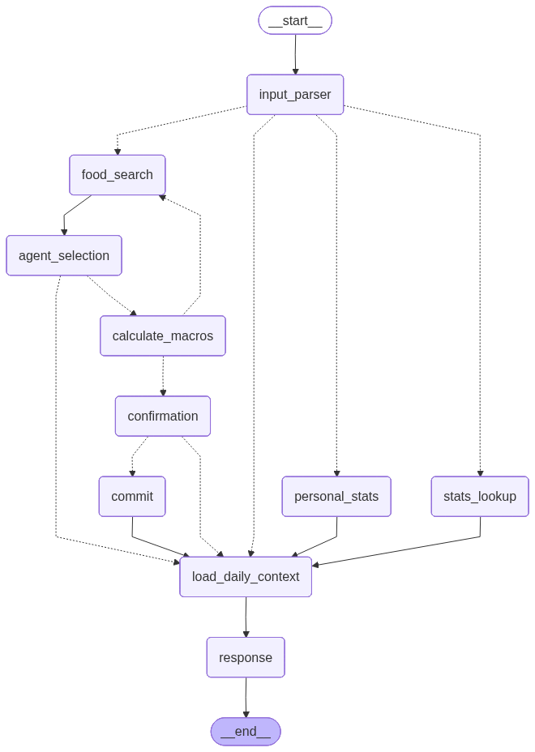
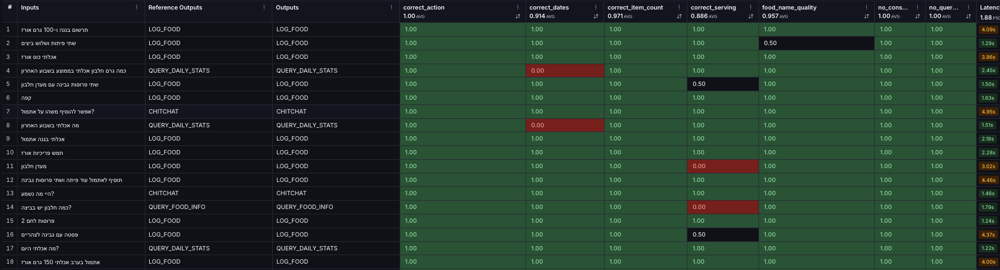
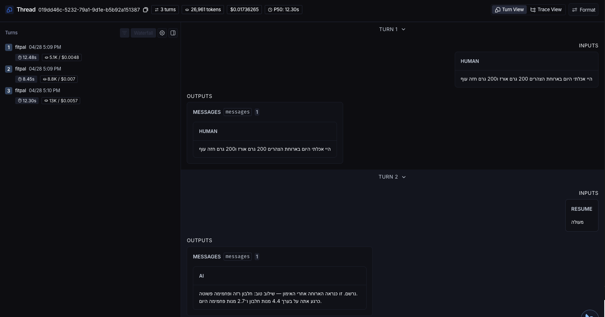

<div align="center">

# 01 · Agent Architecture
### The AI-engineering decisions behind FitPal

</div>

---

## The Graph at a Glance

FitPal's agent is a **`StateGraph`** — a directed graph of typed nodes connected by deterministic edges. Each node is one logical step (parse intent, search the catalog, calculate macros, ask the user to confirm, write to the DB, generate a reply). The shape below is auto-rendered from the live code.

<div align="center">
  
  <br/>
  <sub><i>Auto-rendered from <code>src/agents/nutritionist.py</code>. Solid edges are deterministic; the <code>confirmation</code> node uses <code>Command</code>-based dynamic routing.</i></sub>
</div>

The rest of this doc walks through **why** the graph looks like this.

---

## 1. Deterministic Graph, not ReAct

Most LangChain/LangGraph examples you'll see online use the **ReAct** pattern: hand the LLM a list of tools and let it loop — *think → call tool → think → call tool → answer* — until it decides it's done.

I deliberately **didn't** build FitPal that way. Two reasons:

- **Latency.** Logging *"200g chicken and a banana"* through a ReAct loop is at least 3 LLM round-trips (decide to call `search_food`, decide to call it again, decide to answer). Each round-trip is 1–3 seconds. The user is on Telegram, expecting a chat-speed reply.
- **Cost & predictability.** Every loop iteration burns tokens on a "what should I do next?" thought even though the answer is always the same: parse → search → calculate → confirm → commit → reply. Encoding that order **once, in the graph**, is cheaper, faster, and trivially testable. The agent can't decide to skip the confirmation step.

The graph still leaves the *interesting* decisions to the LLM — what action the user intended (`LOG_FOOD`, `QUERY_DAILY_STATS`, `CHITCHAT`...), what foods are in the message, how to phrase the reply. It just doesn't let the LLM decide the **control flow**.

---

## 2. Structured Output Everywhere (Pydantic at every LLM boundary)

A consequence of the deterministic graph: every LLM call has a **typed contract**. We never parse a free-text response with regex or `json.loads`. The schema is defined as a Pydantic `BaseModel` and bound to the LLM via `.with_structured_output(...)` — under the hood this uses OpenAI's structured-output mode, which **physically prevents** the model from emitting anything that doesn't conform.

The flagship example is `FoodIntakeEvent` — the input parser's output schema:

```python
# src/schemas/input_schema.py
class ActionType(str, Enum):
    LOG_FOOD = "LOG_FOOD"
    QUERY_FOOD_INFO = "QUERY_FOOD_INFO"
    QUERY_DAILY_STATS = "QUERY_DAILY_STATS"
    CHITCHAT = "CHITCHAT"
    LOG_PERSONAL_STATS = "LOG_PERSONAL_STATS"

class SingleFoodItem(BaseModel):
    food_name: str
    count: float
    unit: Literal["g", "piece", "slice", "scoop", "cup", "tbsp", "tsp", ...]
    original_text: str

class FoodIntakeEvent(BaseModel):
    action: ActionType
    items: list[SingleFoodItem] = Field(default_factory=list)
    consumed_at: Optional[datetime] = None
    start_date: Optional[date] = None
    end_date: Optional[date] = None
```

And the binding at the call site:

```python
# src/agents/nodes/input_node.py
llm = get_llm_for_node("input_parser_node")
structured_llm = llm.with_structured_output(FoodIntakeEvent)
parsed: FoodIntakeEvent = await structured_llm.ainvoke([
    SystemMessage(content=system_prompt),
    HumanMessage(content=user_text),
])
# parsed.action  -> ActionType.LOG_FOOD   (enum, not a string we have to validate)
# parsed.items   -> list[SingleFoodItem]  (each one already typed)
```

Downstream nodes consume `parsed.items` as Python objects with known fields. **No runtime parsing errors, no try/except around LLM output.**

---

## 3. The LLM Doesn't Get to Invent Calories

A core decision made up-front: **the database is the source of truth for macros, not the LLM.**

This is the difference between *"GPT-4 thinks a banana has ~89 kcal"* and *"the catalog row for `banana` says 89 kcal per 100g, signed off by the coach."* The first is a hallucination. The second is a controlled fact. For a coaching product where the user is making real decisions about real food, that distinction is everything.

Every macro the user sees is computed from a curated `food_items` row in Supabase Postgres — name, kcal, protein, carbs, fat per 100g — which I (as the surrogate "coach") seeded from a vetted CSV. The graph's `food_search` and `calculate_macros` nodes call **tools** that hit the DB; the LLM never returns macro numbers from its own weights.

**The honest nuance — off-menu foods.** If a user logs something genuinely not in the catalog (*"I had a homemade Moroccan tagine"*), the agent does fall back to LLM estimation via a `MacroEstimation` structured-output schema. But:

1. The estimate is **tagged `source: "estimated"`** in the preview — the user sees a badge, not silent invention.
2. The user must still **confirm** it via the HITL gate (next section).
3. On confirm, the estimate is **persisted as a new `FoodItem` row** with back-calculated per-100g values. The next time anyone logs that food, it's served from the DB — no estimation loop, no drift.

So estimation is the exception, not the path, and it's a one-shot — not an ongoing source of fuzz.

---

## 4. Human-in-the-Loop, Right Before the DB Write

Even with a typed parser and a curated catalog, the risk at the **last mile** — the moment we'd actually persist data — comes from two directions, not one:

- **The LLM might still get it wrong.** It picks the wrong DB match for an ambiguous name, or its off-menu estimate is off, or it misreads a quantity in a long message.
- **The human might mis-type.** *"500 grams of rice"* when they meant 50. *"chiken"* matched to "chicken liver" instead of "chicken breast." A voice-to-text turning a banana into a "bandana." These aren't model failures — they're real-world inputs that no schema can catch.

So FitPal puts a hard gate at the boundary: **nothing reaches the database until the user looks at the parsed batch and says yes.**

The `confirmation` node uses LangGraph's `interrupt()` primitive to pause the graph, send the macro preview back to the user (rendered nicely by the bot — name, grams, kcal, P/C/F per item plus totals, with an "estimated" badge on off-menu items from section 3), and resume with the user's reply on the next turn. The reply itself is parsed by an LLM into a structured `ConfirmationResponse` — so the user can say *"yes"*, *"change the rice to 50g"*, or *"forget it"* in natural language, and the node routes to `commit`, loops back to re-show an updated preview, or skips the write entirely. Multi-turn corrections happen inside the same node without ever leaving the graph.

The screenshot at the end of this doc (section 6) shows this exact mechanism in a real production thread.

---

## 5. Evals — Targeted, Not Aspirational

FitPal has a single-step LangSmith eval suite right now, scoped intentionally:

- **The input parser is evaled, the rest aren't (yet).** That node carries the most responsibility — action classification, multi-item extraction, unit/quantity parsing, temporal reasoning ("yesterday", "this morning"). It's where wrong answers cascade. Evaling it pays off; evaling `commit_node` (which just writes a row) wouldn't.
- **Both Hebrew and English datasets.** Real users mix languages — *"I had 200 גרם of chicken"* — so the parser is tested in both. The Hebrew eval surfaced parsing bugs that the English eval never would have triggered (Hebrew aliases for gender, decimal-comma in heights, RTL date formats).
- **Single-step evaluators**, not end-to-end. Each example is `(input message, expected `FoodIntakeEvent`)`. The evaluator scores per-field — was `action` right, were the items extracted correctly, was the date resolved correctly. This pinpoints regressions to a specific responsibility instead of "the whole agent felt off."
- **LLM-as-judge for the fields that don't have one right answer.** Most fields can be graded deterministically (`correct_action`, `correct_dates`, `correct_item_count` — exact match against the reference). But the extracted `food_name` is fuzzy — *"chicken breast"*, *"חזה עוף"*, *"grilled chicken breast"* are all reasonable normalizations of *"חזה עוף בגריל"* depending on what the DB lookup needs. So `food_name_quality` is scored by a second LLM acting as a judge with a rubric (does the name preserve the food identity, is it specific enough for catalog lookup, does it strip irrelevant adjectives) — the 0.957 average in the screenshot below comes from that judge, not a string match.

<div align="center">
  
  <br/>
  <sub><i>Hebrew eval run on the input parser. Per-field evaluators: <code>correct_action</code> (1.00), <code>correct_dates</code> (0.914), <code>correct_item_count</code> (0.971), <code>correct_serving</code> (0.886), <code>food_name_quality</code> (0.957). Red cells flag the exact rows that regressed.</i></sub>
</div>

---

## 6. Observability — Every Conversation Is a Trace

Every interaction with the deployed agent is automatically traced to **LangSmith**: every node call, every LLM call (with prompts, tokens, cost, latency), every tool call (with arguments and DB results), every state transition. When a user reports a weird reply, debugging is one click — open the trace, scroll to the node where it went sideways, see the exact prompt and the exact response.

This has been disproportionately useful. The prod date bug that motivated my current refactor was found this way: a user said *"add to yesterday"*, the food landed on today, I opened LangSmith, and the trace `019dd286` showed the input parser emitting `consumed_at` AND `start_date/end_date` simultaneously — a class of bug that wouldn't have shown up in the eval suite because the eval inputs don't reliably trigger both date shapes at once. The trace is what made the root cause visible.

And of course we built a skill for that. The `langsmith-trace` Claude Code skill takes a thread ID, pulls the full trace via the LangSmith CLI, and feeds the whole thing — every node, every prompt, every response — straight into Claude's context. So the debugging loop is no longer *"open the LangSmith UI, click around, copy text into a prompt"* — it's *"give Claude the thread ID and ask why turn 2 went weird."* The trace becomes a first-class debugging artifact the agent can reason over end-to-end. (More on the skill system in [doc 02](02-working-with-claude-code.md).)

<div align="center">
  
  <br/>
  <sub><i>A real production thread. Turn 1: user logs food in Hebrew. Turn 2: graph paused at <code>interrupt()</code>, user resumes with <code>"מעולה"</code> ("great"), the agent commits and replies. Every node call, LLM call, token count, and latency for the full conversation is one click away.</i></sub>
</div>

---

<div align="center">
<sub>← <a href="README.md">Back to README</a> &nbsp;·&nbsp; Next: <a href="02-working-with-claude-code.md">02 · Working with Claude Code</a> →</sub>
</div>
