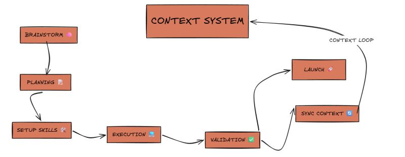
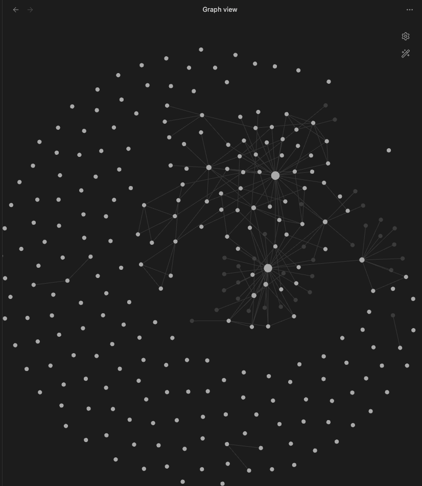

# 02 · Working with Claude Code
### The PIV loop, custom skills, and a second brain

---

## Opening

I took inspiration for this workflow from [this reference repo](https://github.com/coleam00/habit-tracker/tree/main/.claude), which sketched out a PIV-loop scaffold for working with Claude Code. I also wrote a [LinkedIn post](https://www.linkedin.com/feed/update/urn:li:activity:7434572339662475264/) walking through how I use it.

What follows is the version actually running on FitPal — what the loop looks like end-to-end, how it evolved from commands into skills, and the second-brain layer I added on top.

---

## 1. The Loop

  
   
  <i>The loop in one picture. Solid arrows are the per-feature path; the <b>Context Loop</b> arrow at the top is what makes the system compound — every cycle's learnings flow back into the Context System before the next cycle begins.</i>

A typical FitPal feature flows through these stages:

- **Brainstorm** — rough scope, tradeoffs, what we're actually trying to solve. Usually a free-form chat with Claude after the project context has been primed.
- **Planning** — a `plan-feature` skill turns the brainstorm into a written plan with tasks, affected files, edge cases, and verification gates. The plan lands at `docs/plans/<feature>.md`.
- **Setup Skills** — surface the right skills for the job before execution starts. For most features this is implicit — the skills auto-trigger.
- **Execution** — `execute` reads the plan and implements it task-by-task in a clean chat, so planning context doesn't pollute the implementation window.
- **Validation** — `validation` runs lint + the three test tiers (unit, integration, graph-api) and reports back. Red = fix and re-run.
- **Launch or Sync Context** — green validation either ships via `commit` (commit + PR with repo-style messages), or first feeds learnings back into the system.
- **Context Loop** — `sync-context` updates `CLAUDE.md`, the affected skills, and adds new patterns or RCAs. The next cycle starts from a richer baseline.

That last loop is what makes the whole thing compound. Without it the workspace would calcify; with it, every cycle leaves the project a little more self-aware.

---

## 2. From Commands to Skills

The original scaffold was built around **commands** — `.claude/commands/*.md` files invoked with `/prime`, `/plan-feature`, `/execute`. Claude Code has since shipped a richer **Skills** system, so I rebuilt the loop on top of it.

The difference matters. Skills carry frontmatter with a `description` and **trigger automatically** when the user's intent matches — not only on slash invocations. So when I type *"I want to plan the new HITL add-item feature"*, the right skill fires without me remembering its name. The loop becomes an ambient property of the workspace instead of a checklist I have to recite.

Current FitPal skill set:

| Skill | What it does |
|---|---|
| `prime` | Loads and summarizes project context at session start |
| `plan-feature` | Generates a structured implementation plan in `docs/plans/` |
| `execute` | Implements an existing plan task-by-task in a clean window |
| `validation` | Runs lint + the three test tiers, reports failures with paths |
| `commit` | Creates a properly-formatted commit + PR using repo conventions |
| `pr-review` | Reviews PRs with architectural awareness of the project |
| `sync-context` | Updates `CLAUDE.md`, skills, and patterns after a cycle |
| `focus` | Plans a focused work session — what to tackle next, and why |
| `bug-fix` | Root-causes a bug and implements the fix |

Plus a handful of FitPal-specific ones — `test-engineering`, `eval-debugger`, `eval-setup`, and the `langsmith-trace` skill referenced in [doc 01 §6](01-agent-architecture.md#6-observability--every-conversation-is-a-trace).

---

## 3. Skills Evolve With the Project

This is the part that took me a while to internalize: skills are not static prompts I retype. They're **versioned files in the repo** that get edited every time something stops fitting.

A few real examples:

- **`validation`** started life as "run pytest." It now knows about FitPal's three test tiers, the lint gate, the difference between "unit must pass before commit" and "graph-api can be slow and is run separately," and how to report failures with file paths the user can click.
- **`plan-feature`** learned to read `docs/patterns/` before drafting, so plans automatically respect the tool-first and async patterns instead of inventing parallel approaches the codebase already disagrees with.
- **`commit`** learned the repo's commit style by example — the format on every commit in this repo (including this doc) is encoded in the skill, not typed by hand each time.

The mechanism for this evolution is the **Sync Context** stage at the end of every loop. Every cycle ends with the question *"did we discover anything worth keeping?"* — and if the answer is yes, the relevant skill, pattern doc, or `CLAUDE.md` section gets updated. After enough cycles the workspace stops feeling like a fresh chat and starts feeling like a colleague who's been on the project for months.

---

## 4. The Second Brain — Obsidian

Early on I was drowning in my own project. Dozens of half-formed ideas, scattered TODOs, RCAs I'd write and lose, "I should remember this" moments that I never did. The PIV loop was making the *implementation* sharp, but the *thinking around it* was a mess. So I built a second brain to hold the human-side context the same way `.claude/` holds the agent-side context.

  
   
  <b>I know you can't read anything from this — but trust me, it looks cool and it's actually useful.</b>

 

The repo has two parallel context systems:

- **`.claude/` and `CLAUDE.md`** — what Claude reads at runtime. Skills, patterns, validation gates. Optimized for the agent.
- **`brain/`** — an Obsidian vault for what *I* think about between sessions. Discovery docs, RCAs, planning sketches, reading notes, half-formed ideas. Optimized for me. At its top sit two anchor files — `GOALS.md` (the long-arc *why*) and `TASKS.md` (the prioritized *what's next*) — so the chaos always resolves to a single place when I sit down to start a session.

The two talk to each other. A typical flow:

1. I notice a weird production behavior. I dump raw notes into Obsidian.
2. The `refine-dump` skill turns the dump into a structured note — a discovery doc with extracted action items and links to related notes.
3. That discovery doc gets linked into a plan in `docs/plans/`.
4. `execute` runs the plan; the commit log goes into `commit_logs/`.
5. `sync-context` updates `CLAUDE.md` if the bug surfaced a new project-wide pattern.

The prod date bug from [doc 01 §6](01-agent-architecture.md#6-observability--every-conversation-is-a-trace) followed exactly this path: a late-night LangSmith trace → an Obsidian discovery doc → a state-lifecycle audit in `brain/planning/` → a refactor plan in `docs/plans/` → the in-progress refactor on the current branch.

---

---

## In Summary

The loop, the skills, and the second brain aren't separate ideas — they're one system that gets more useful the longer it runs. After a few months on FitPal:

- **Hundreds of files of accumulated context** — a written plan for every feature, a commit log for every meaningful change, discovery docs for every prod incident, RCAs for the surprising ones. None of it is throwaway.
- **A workspace that stays current.** `CLAUDE.md` reflects how the project is *today*, not how I scaffolded it on day one. New patterns earn their way in; old ones get retired the moment they stop describing reality.
- **Skills that mean something specific to this project.** `validation` knows what *FitPal* validation looks like. `plan-feature` knows what a *FitPal* plan looks like. They're not generic prompts; they're tooling.
- **Plenty more I didn't include here.** Eval-debugging skills, focus-session rituals, custom commit-log formats, project-specific test conventions, an `adr` skill that records architecture decisions in `docs/adr/`, and an init-project flow that sets up a new repo with this loop pre-installed. The system keeps absorbing patterns I find useful, and every new session starts with all of them already in place.

If we get a chance to meet live, I'd be happy to run one full rotation of the loop on a real FitPal task — Brainstorm → Plan → Execute → Validate → Commit — so you can see what one cycle actually looks like in practice rather than as a diagram.

---

← Previous: <a href="01-agent-architecture.md">01 · Agent Architecture</a> &nbsp;·&nbsp; <a href="README.md">Back to README</a>

