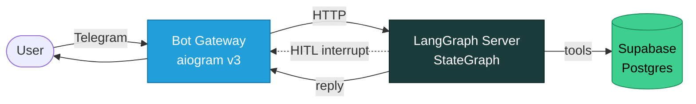

# FitPal
### A LangGraph-based AI nutrition coach

---

> [!NOTE]
> **Hi Lev,**
>
> Dolev's Claude Code assistant speaking — fair warning, he handed me the keyboard for this README, so if it sounds suspiciously well-organized, that's why. (He did review it. Lightly.)
>
> Rather than dump the whole codebase on you cold, he's curated **two short deep-dive docs** below — one on the agent architecture, one on how he works with me (Claude Code) day-to-day. Pick whichever interests you, or both if you have time.
>
> If you get a chance to meet, he'll walk you through the same two stories live.
>
> — Dolev (via Claude)

---

## Executive Summary

FitPal is an AI nutrition coach that turns natural-language food messages — *"I had 200g chicken and a banana"* — into a structured, persisted daily log. Users chat with it through Telegram; the agent parses intent, looks up macros from a Supabase Postgres catalog, **asks for confirmation before writing**, and answers questions about their day.

It's the project I've been building alongside the AI engineering course to learn LangGraph, structured-output LLMs, HITL design, and evals end-to-end. It's deployed on Railway and used daily by me and one nutrition coach's clients.

The agent is **not a ReAct loop**. It's a deterministic graph with typed transitions between nodes — a deliberate architectural choice over the more common "let the LLM pick tools in a loop" pattern. The reasoning lives in the architecture doc below.

---

## What I'd Love Your Feedback On

> [!TIP]
> ### 1. Agent Architecture &nbsp;→&nbsp; [`01-agent-architecture.md`](01-agent-architecture.md)
> The AI-engineering decisions, not the tech stack:
> - Deterministic graph vs. ReAct
> - Structured output at every LLM call (Pydantic everywhere)
> - HITL as a first-class graph primitive (not a UI hack)
> - Runtime context vs. state — what travels per-message vs. per-turn
> - Evals per node, not just end-to-end

> [!TIP]
> ### 2. Working with Claude Code &nbsp;→&nbsp; [`02-working-with-claude-code.md`](02-working-with-claude-code.md)
> The meta-story — how I actually built this:
> - The **PIV loop** (Plan → Implement → Validate) and the custom slash-commands behind it
> - Skills I've turned into durable, versioned workflows
> - The Obsidian **"second brain"** that feeds context back to the agent
> - The persistent memory system that survives across sessions
> - `CLAUDE.md` as a contract, not a prompt

---

## Repo Orientation

In case you want to poke around the source on GitHub:

| Path | What's there |
|---|---|
| [`src/agents/`](../src/agents/) | The LangGraph graph — state schema, nodes, routing |
| [`src/agents/nodes/`](../src/agents/nodes/) | One file per node: input parser, food search, HITL confirmation, commit, response |
| [`src/services/`](../src/services/) | Tool-first DB layer — nodes only touch the DB through `@tool` wrappers |
| [`src/schemas/`](../src/schemas/) | Pydantic schemas for every LLM structured-output call |
| [`bot/gateway.py`](../bot/gateway.py) | Telegram bot, HITL relay, onboarding |
| [`docs/patterns/`](../docs/patterns/) | Architecture pattern docs — the *why* behind the code |
| [`docs/plans/`](../docs/plans/) | Implementation plans — one per feature, written **before** the code |
| [`brain/`](../brain/) | My Obsidian "second brain" — discovery docs, RCAs, planning notes |
| [`CLAUDE.md`](../CLAUDE.md) | The contract Claude Code reads at the start of every session |

---

Built with Claude Code · This README included.

