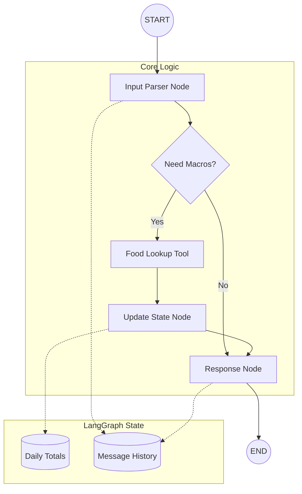

# LangGraph Architecture: FitPal MVP

This document describes the state machine flow for the FitPal AI Agent using Mermaid notation.

## Graph Flow Diagram



## Node Responsibilities

| Node | Responsibility | Input | Output |
| :--- | :--- | :--- | :--- |
| **Input Parser** | Extract structured data from natural language. | User Text | `FoodIntake` Pydantic Model |
| **Food Lookup** | Retrieve nutritional values from database. | Food Name, Amount | Macro Values (P, C, F, Cal) |
| **Update State** | Accumulate values into the global daily state. | Macro Values | Updated `NutritionState` |
| **Response** | Generate a human-readable confirmation. | Updated State | Agent Message |

## State Schema (TypedDict)
```python
class NutritionState(TypedDict):
    messages: Annotated[list, add_messages]
    totals: dict # {calories, protein, carbs, fat}
    last_processed: dict # Info about the last tool call
```
