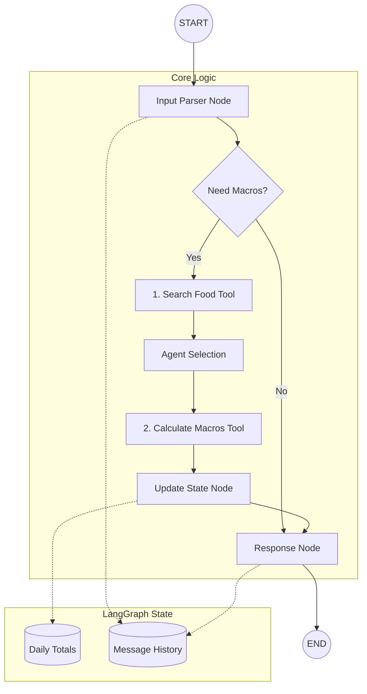

# Product Requirements Document: FitPal AI Agent

## 1. Executive Summary
FitPal is an intelligent AI fitness and nutrition coach designed to bridge the gap between traditional meal planning and the friction of daily logging. Built on the **LangGraph** framework, the agent acts as a stateful companion that understands natural language, tracks macronutrients (Protein, Carbs, Fats) and Calories in real-time, and provides personalized feedback based on a user's specific meal plan.

The MVP focuses on the core utility: accurately parsing natural language food intake, looking up nutritional values from a local database, and maintaining a session-based state of daily totals.

## 2. Mission & Core Principles
**Mission**: To make rigid nutrition plans flexible and easy to follow through effortless natural language interaction.

**Core Principles**:
- **Zero Friction**: Logging food should feel like texting a friend.
- **Accuracy**: Base calculations on structured data, not LLM "hallucinations" of calories.
- **Context Awareness**: The agent must know what you've already eaten and what your target is.
- **Transparency**: Clear feedback on how values were calculated.

## 3. Target Users
### Persona: The Disciplined Tracker
- **Goals**: Stay within macros to hit weight/muscle targets.
- **Pain Points**: Manual search in calorie tracking apps is tedious and time-consuming.
- **Needs**: A quick way to log complex meals (e.g., "50g chicken and 200g rice") and get immediate totals.

## 4. MVP Scope

### In-Scope (✅)
- **LangGraph Orchestration**: Core logic for food intake tracking and reasoning.
- **Natural Language Parsing**: Converting "I ate 50g of chicken" into structured JSON using LLM and Pydantic.
- **Stateful Tracking**: Maintaining daily totals within a LangGraph session (short-term memory).
- **Core Reasoning**: Answering questions based on the current state.

### Out-of-Scope (❌)
- **User Interface (UI)**: No Web or Desktop UI in this phase.
- **API (REST/GraphQL)**: No external API endpoints.
- **Image Recognition**: Photo-to-macros conversion.
- **Multi-User Support**: Initial version is a local, single-user logic instance.

## 5. User Stories
1. **As a user**, I want to type "I had a 200g steak" so that the agent automatically finds the protein and fat content.
2. **As a user**, I want to ask "How much protein do I have left?" so I can decide if I should eat more.
3. **As a user**, I want to correct my entry if I made a mistake so my daily stats remain accurate.

## 6. Core Architecture & Patterns

### High-Level Architecture
#### Graph Flow Diagram



### Node Responsibilities

| Node | Responsibility | Input | Output |
| :--- | :--- | :--- | :--- |
| **Input Parser** | Extract structured data from natural language. | User Text | `FoodIntake` Pydantic Model |
| **Food Search** | Find food candidates by name (returns ID/Name). | Food Name | List[{id, name}] |
| **Calculate Macros** | Calculate exact macros for ID and Amount. | Food ID, Amount (g) | Total Macros (P, C, F, Cal) |
| **Update State** | Accumulate values into the global daily state. | Macro Values | Updated `NutritionState` |
| **Response** | Generate a human-readable confirmation. | Updated State | Agent Message |

### State Schema (TypedDict)
```python
class NutritionState(TypedDict):
    messages: Annotated[list, add_messages]
    totals: dict # {calories, protein, carbs, fat}
    last_processed: dict # Info about the last tool call
```

### Directory Structure
```text
fit_pal/
├── commit_logs/             # History of commits
├── data/
│   ├── nutrition.db         # Nutritional database (SQLite)
│   ├── nutrients_csvfile.csv # Source data
│   ├── meal_plan.txt        # User's targets
│   └── logs/                 # Historical daily logs
├── src/
│   ├── agents/
│   │   ├── nutritionist.py   # LangGraph definition
│   │   └── state.py         # Schema and TypedDict
│   ├── scripts/
│   │   └── ingest_simple_db.py # ETL script
│   ├── tools/
│   │   └── food_lookup.py   # Database search logic
│   ├── database.py          # Database connection
│   ├── models.py            # SQLAlchemy models
│   ├── main.py              # Entry point
│   └── config.py            # Environment & LLM setup
├── tests/                   # Integration & Unit tests
├── notebooks/
│   └── evaluate_lookup.ipynb # Analysis notebook
├── PRD.md
└── README.md
```

## 7. Technology Stack
- **Orchestration**: LangGraph.
- **LLM Framework**: LangChain 1.x.
- **Schema Validation**: Pydantic v2.
- **LLM Model**: Claude 3.5 Sonnet or GPT-4o.
- **Data Processing**: Pandas (for CSV/Database lookup).
- **Storage**: SQLite (Checkpointer for state).
- **Language**: Python 3.10+.
- **Package Manager**: uv (Required for dependency management).

## 8. Database Schema & Data Source

### Food Database
The food database is populated from a simplified CSV dataset (`nutrients_csvfile.csv`) containing ~335 common items.
All values are normalized to **100g**.

| Column | Type | Unit | Description |
| :--- | :--- | :--- | :--- |
| `id` | Integer | - | Primary Key |
| `name` | String | - | Food Name (e.g., "Rice", "Breads... - White") |
| `calories`| Float | kcal | per 100g |
| `protein` | Float | grams | per 100g |
| `carbs` | Float | grams | per 100g |
| `fat` | Float | grams | per 100g |

## 9. Implementation Phases

### Phase 1: MVP Logic Foundations
- Setup LangGraph environment and base development structure.
- Implementation of `FoodIntake` Pydantic models for extraction.
- Create placeholder `Food_Lookup_Tool` (to be integrated once DB is imported).
- Build and test core LangGraph flow: Input -> Parse -> State Update.

### Phase 2: Knowledge Integration
- Add RAG/File-loading for the `Meal Plan`.
- Implement "Remaining Macros" logic.
- Support for target-based questions ("Can I eat this?").

### Phase 3: Persistence & Reliability
- Integrate SQLite `Checkpointer` for persistent sessions.
- Implement **Correction Flow** (delete/update entries).
- Add structured logging to `daily_log.json`.

### Phase 4: Polish & Intelligence
- Enable LangSmith tracing.
- Upgrade to Semantic Search for food lookup.
- Proactive coaching logic (suggestions for ending the day).
