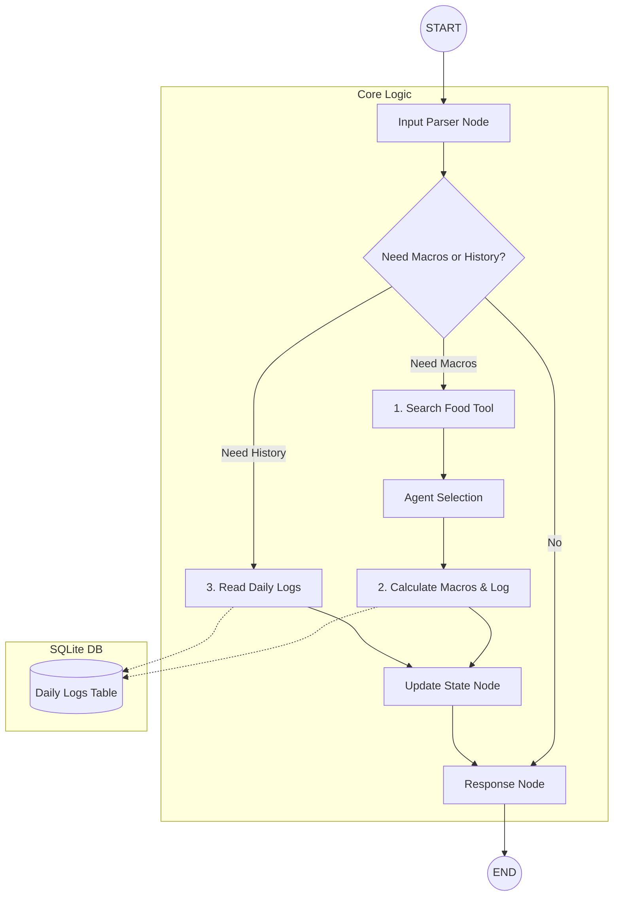

# Product Requirements Document: FitPal AI Agent

## 1. Executive Summary
FitPal is an intelligent AI fitness and nutrition coach designed to bridge the gap between traditional meal planning and the friction of daily logging. Built on the **LangGraph** framework, the agent acts as a stateful companion that understands natural language, tracks macronutrients (Protein, Carbs, Fats) and Calories in real-time, and provides personalized feedback based on a user's specific meal plan.

The MVP focuses on the core utility: accurately parsing natural language food intake, looking up nutritional values from a local database, and maintaining a session-based state of daily totals.

## 2. Mission & Core Principles
**Mission**: To make rigid nutrition plans flexible and easy to follow through effortless natural language interaction.

**Core Principles**:
- **Zero Friction**: Logging food should feel like texting a friend.
- **Accuracy**: Base calculations on structured data, not LLM "hallucinations" of calories.
- **Context Awareness**: The agent must know what you've already eaten and what your target is.
- **Transparency**: Clear feedback on how values were calculated.

## 3. Target Users
### Persona: The Disciplined Tracker
- **Goals**: Stay within macros to hit weight/muscle targets.
- **Pain Points**: Manual search in calorie tracking apps is tedious and time-consuming.
- **Needs**: A quick way to log complex meals (e.g., "50g chicken and 200g rice") and get immediate totals.

## 4. MVP Scope

### In-Scope (✅)
- **LangGraph Orchestration**: Core logic for food intake tracking and reasoning.
- **Natural Language Parsing**: Converting "I ate 50g of chicken" into structured JSON using LLM and Pydantic.
- **Stateful Tracking**: Maintaining daily totals within a LangGraph session (short-term memory).
- **Core Reasoning**: Answering questions based on the current state.

### Out-of-Scope (❌)
- **User Interface (UI)**: No Web or Desktop UI in this phase.
- **API (REST/GraphQL)**: No external API endpoints.
- **Image Recognition**: Photo-to-macros conversion.
- **Multi-User Support**: Initial version is a local, single-user logic instance.

## 5. User Stories
1. **As a user**, I want to type "I had a 200g steak" so that the agent automatically finds the protein and fat content.
2. **As a user**, I want to ask "How much protein do I have left?" so I can decide if I should eat more.
3. **As a user**, I want to correct my entry if I made a mistake so my daily stats remain accurate.

## 6. Core Architecture & Patterns

### High-Level Architecture
#### Graph Flow Diagram



### Node Responsibilities

| Node | Responsibility | Input | Output |
| :--- | :--- | :--- | :--- |
| **Input Parser** | Extract structured data from natural language. | User Text | `FoodIntake` Pydantic Model |
| **Food Search** | Find food candidates by name (returns ID/Name). | Food Name | List[{id, name}] |
| **Agent Selection** | Intelligent selection of best match from search results. | User Msg + Results | Selected Food ID / "No Match" |
| **Calc & Log** | Calculate macros, log to DB, and update daily state. | Food ID, Amount (g) | Updated `AgentState` |
| **Response** | Generate a human-readable confirmation. | Updated State | Agent Message |

### State Schema (TypedDict)

**Note**: As of 2026-02-12, the state schema is being refactored to use proper nested TypedDict definitions for type safety. See [refactor-state-schema-and-multi-item-loop.md](../.agent/plans/refactor-state-schema-and-multi-item-loop.md) for details.

```python
from typing import TypedDict, List, Annotated, Optional
from datetime import date
from langgraph.graph import add_messages

class PendingFoodItem(TypedDict):
    """Single food item waiting to be processed."""
    food_name: str
    amount: float
    unit: str
    original_text: str

class SearchResult(TypedDict):
    """Result from food database search."""
    id: int
    name: str

class DailyTotals(TypedDict):
    """Aggregated nutritional totals from database."""
    calories: float
    protein: float
    carbs: float
    fat: float

class AgentState(TypedDict):
    """Main graph state with type-safe nested structures."""
    messages: Annotated[list, add_messages]
    pending_food_items: List[PendingFoodItem]  # ✅ Type-safe (refactored from List[dict])
    daily_totals: DailyTotals                   # ✅ Type-safe (refactored from dict)
    current_date: date                          # Track which day we're logging
    last_action: str                            # Last node action (for routing)
    search_results: List[SearchResult]          # ✅ Type-safe (refactored from List[dict])
    selected_food_id: Optional[int]             # Selected food ID from agent selection
```

**Architectural Decision**: 
- **TypedDict for state**: Ensures type safety, IDE autocomplete, and proper serialization to SQLite checkpointer
- **Pydantic for LLM output**: Used with `.with_structured_output()` for validation, then converted to dict via `.model_dump()`
- **Nested TypedDict structures**: Replaces vague `List[dict]` types with explicit schemas

**Note**: Individual macro fields (`daily_calories`, `daily_protein`, etc.) removed in favor of querying DB directly using write-through pattern.

### Directory Structure
```text
fit_pal/
├── commit_logs/             # History of commits
├── data/
│   ├── nutrition.db         # Nutritional database (SQLite)
│   ├── nutrients_csvfile.csv # Source data
│   ├── meal_plan.txt        # User's targets
│   └── logs/                 # Historical daily logs
├── src/
│   ├── agents/
│   │   ├── nutritionist.py   # LangGraph definition
│   │   ├── state.py         # Schema and TypedDict
│   │   └── nodes/           # Node implementations
│   │       └── input_node.py  # Input parser node
│   ├── services/            # Business logic layer
│   │   └── daily_log_service.py  # CRUD for daily logs
│   ├── scripts/
│   │   └── ingest_simple_db.py # ETL script
│   ├── tools/
│   │   └── food_lookup.py   # Database search logic
│   ├── schemas/             # Pydantic models
│   │   └── input_schema.py  # FoodIntakeEvent schema
│   ├── database.py          # Database connection
│   ├── models.py            # SQLAlchemy models (FoodItem, DailyLog)
│   ├── main.py              # Entry point
│   └── config.py            # Environment & LLM setup
├── tests/
│   ├── unit/                # Unit tests (pytest)
│   ├── conftest.py          # Pytest fixtures
│   └── test_food_lookup.py  # Legacy/Integration tests
├── notebooks/
│   └── evaluate_lookup.ipynb # Analysis notebook
├── PRD.md
└── README.md
```

### Data Standards (New)
- **Units**: All food quantities must be normalized to **grams** (`g`) by the LLM.
- **Schema**: Inputs are strictly validated as `amount` (float) and `unit` (Literal["g"]).

## 7. Technology Stack
- **Orchestration**: LangGraph.
- **LLM Framework**: LangChain 1.x.
- **Schema Validation**: Pydantic v2.
- **LLM Model**: Claude 3.5 Sonnet or GPT-4o.
- **Data Processing**: Pandas (for CSV/Database lookup).
- **Storage**: SQLite (Checkpointer for state).
- **Language**: Python 3.10+.
- **Package Manager**: uv (Required for dependency management).

## 8. Database Schema & Data Source

### Food Database
The food database is populated from a simplified CSV dataset (`nutrients_csvfile.csv`) containing ~335 common items.
All values are normalized to **100g**.

| Column | Type | Unit | Description |
| :--- | :--- | :--- | :--- |
| `id` | Integer | - | Primary Key |
| `name` | String | - | Food Name (e.g., "Rice", "Breads... - White") |
| `calories`| Float | kcal | per 100g |
| `protein` | Float | grams | per 100g |
| `carbs` | Float | grams | per 100g |
| `fat` | Float | grams | per 100g |

### Daily Log Database
Stores confirmed food entries for long-term tracking.

| Column | Type | Description |
| :--- | :--- | :--- |
| `id` | Integer | Primary Key |
| `food_id` | Integer | Foreign Key (FoodItem) |
| `amount_g` | Float | Quantity Consumed |
| `calories` | Float | Calculated Calories |
| `protein` | Float | Calculated Protein |
| `carbs` | Float | Calculated Carbs |
| `fat` | Float | Calculated Fat |
| `timestamp` | DateTime(TZ) | When food was eaten (UTC) |
| `meal_type` | String | breakfast/lunch/dinner/snack (nullable) |
| `created_at` | DateTime(TZ) | When entry was created |
| `updated_at` | DateTime(TZ) | When entry was last modified |
| `original_text` | String | User's original input (nullable) |

## 9. Implementation Phases

### Phase 1: MVP Logic Foundations
- ✅ Setup LangGraph environment and base development structure.
- ✅ Implementation of `FoodIntakeEvent` Pydantic models for extraction.
- ✅ Create `search_food` and `calculate_food_macros` tools.
- ✅ Implement **Daily Log Persistence** with service layer pattern:
  - ✅ Create `DailyLog` SQLAlchemy model with full schema
  - ✅ Create `src/services/daily_log_service.py` for CRUD operations
  - ✅ Update `AgentState` schema (remove individual macro fields)
  - ✅ Implement write-through pattern (DB as source of truth)
- ✅ Implement **Agent Selection Node** for intelligent ambiguity handling.
- ✅ **Refactor State Schema** for type safety (Completed 2026-02-13):
  - ✅ Replace `List[dict]` with proper TypedDict definitions (PendingFoodItem, SearchResult, DailyTotals)
  - ✅ Add validation for LLM responses
  - ✅ Update system prompts (cooked over raw preference)
- ✅ **Multi-Item Loop Processing** (Completed 2026-02-13):
  - ✅ Implement graph routing to handle multiple food items
  - ✅ Create placeholder calculate_log_node
  - ✅ Add loop-back logic for sequential processing
- 🚧 Build core LangGraph flow: Input -> Search -> Agent Selection -> Calc & Log -> Response (Calculate node needs full implementation).

### Phase 2: Knowledge Integration
- Add RAG/File-loading for the `Meal Plan`.
- Implement "Remaining Macros" logic.
- Support for target-based questions ("Can I eat this?").

### Phase 3: Persistence & Reliability
- Integrate SQLite `Checkpointer` for persistent sessions.
- Implement **Correction Flow** (delete/update entries).
- Add structured logging to `daily_log.json`.

### Phase 4: Polish & Intelligence
- Enable LangSmith tracing.
- Upgrade to Semantic Search for food lookup.
- Proactive coaching logic (suggestions for ending the day).
