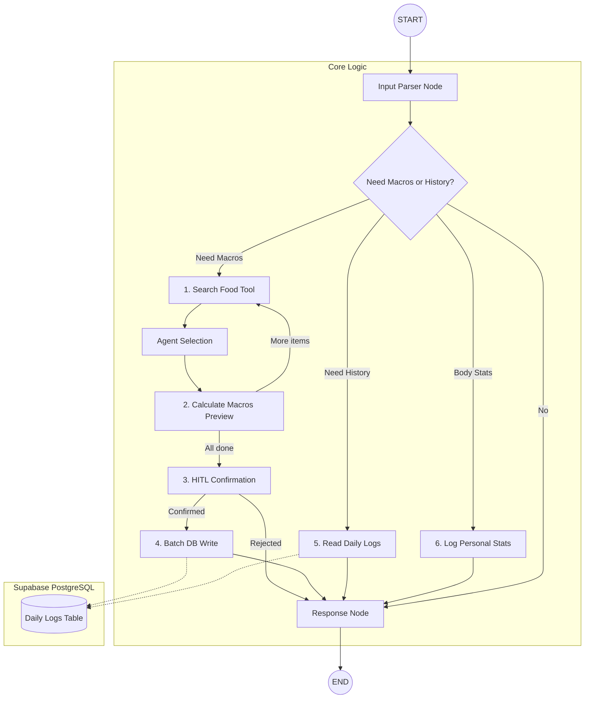

# Product Requirements Document: FitPal AI Agent

## 1. Executive Summary
FitPal is an intelligent AI fitness and nutrition coach designed to bridge the gap between traditional meal planning and the friction of daily logging. Built on the **LangGraph** framework, the agent acts as a stateful companion that understands natural language, tracks macronutrients (Protein, Carbs, Fats) and Calories in real-time, and provides personalized feedback based on a user's specific meal plan.

The MVP focuses on the core utility: accurately parsing natural language food intake, looking up nutritional values from a local database, and maintaining a session-based state of daily totals.

## 2. Mission & Core Principles
**Mission**: To make rigid nutrition plans flexible and easy to follow through effortless natural language interaction.

**Core Principles**:
- **Zero Friction**: Logging food should feel like texting a friend.
- **Accuracy**: Base calculations on structured data, not LLM "hallucinations" of calories.
- **Context Awareness**: The agent must know what you've already eaten and what your target is.
- **Transparency**: Clear feedback on how values were calculated.

## 3. Target Users
### Persona: The Disciplined Tracker
- **Goals**: Stay within macros to hit weight/muscle targets.
- **Pain Points**: Manual search in calorie tracking apps is tedious and time-consuming.
- **Needs**: A quick way to log complex meals (e.g., "50g chicken and 200g rice") and get immediate totals.

## 4. MVP Scope

### In-Scope (✅)
- **LangGraph Orchestration**: Core logic for food intake tracking and reasoning.
- **Natural Language Parsing**: Converting "I ate 50g of chicken" into structured JSON using LLM and Pydantic.
- **Stateful Tracking**: Maintaining daily totals within a LangGraph session (short-term memory).
- **Core Reasoning**: Answering questions based on the current state.
- **Multi-User Support**: Supabase Auth (JWT) + LangGraph custom auth handler + RLS on `food_items`/`daily_logs`. Telegram bot gateway with passphrase access control and auto-registration.

### Out-of-Scope (❌)
- **User Interface (UI)**: No Web or Desktop UI in this phase.
- **API (REST/GraphQL)**: No external API endpoints.
- **Image Recognition**: Photo-to-macros conversion.

## 5. User Stories
1. **As a user**, I want to type "I had a 200g steak" so that the agent automatically finds the protein and fat content.
2. **As a user**, I want to ask "How much protein do I have left?" so I can decide if I should eat more.
3. **As a user**, I want to correct my entry if I made a mistake so my daily stats remain accurate.

## 6. Core Architecture & Patterns

### High-Level Architecture
#### Graph Flow Diagram


```mermaid
flowchart TD
    START((START)) --> InputNode[Input Parser Node]

    subgraph Core_Logic [Core Logic]
        InputNode --> ToolCall{Need Macros or History?}

        ToolCall -- Need Macros --> SearchTool[1. Search Food Tool]
        SearchTool --> SelectNode[Agent Selection]
        SelectNode --> CalcMacros[2. Calculate Macros Preview]
        CalcMacros -- More items --> SearchTool
        CalcMacros -- All done --> Confirm[3. HITL Confirmation]
        Confirm -- Confirmed --> Commit[4. Batch DB Write]
        Confirm -- Rejected --> ResponseNode

        ToolCall -- Need History --> ReadLog[5. Read Daily Logs]
        ToolCall -- Body Stats --> PersonalStats[6. Log Personal Stats]

        Commit --> ResponseNode
        ReadLog --> ResponseNode
        PersonalStats --> ResponseNode

        ToolCall -- No --> ResponseNode
    end

    ResponseNode[Response Node] --> END((END))

    subgraph Database [Supabase PostgreSQL]
        DailyLogsTable[(Daily Logs Table)]
    end

    Commit -.-> DailyLogsTable
    ReadLog -.-> DailyLogsTable
```

### Node Responsibilities

| Node | Responsibility | Input | Output |
| :--- | :--- | :--- | :--- |
| **Input Parser** | Extract structured data from natural language. | User Text | `FoodIntake` Pydantic Model |
| **Food Search** | Find food candidates by name (returns ID/Name). | Food Name | List[{id, name}] |
| **Agent Selection** | Intelligent selection of best match from search results. | User Msg + Results | Selected Food ID / "No Match" |
| **Calc Macros** | Calculate macros preview (DB lookup or LLM estimation). | Food ID, Amount (g) | `MacroResult` in `pending_confirmations` |
| **Confirmation** | HITL batch confirmation via `interrupt()` loop. | `pending_confirmations` | `Command` → commit or response |
| **Commit** | Batch DB write after user confirms. | Confirmed batch | Updated `AgentState` |
| **Stats Lookup** | Retrieve historical log data (single day or range). | Current Date / Range | `daily_log_report` |
| **Personal Stats** | Log body measurements (weight, body fat %). | User message | `processing_results` |
| **Response** | Generate a human-readable confirmation. | Updated State | Agent Message |

### State Schema (TypedDict)

**Note**: As of 2026-02-21, the state schema leverages the LangGraph "Multiple Schemas" pattern for clean LangSmith Studio integration.

```python
from typing import TypedDict, List, Annotated, Optional, Literal
from datetime import date, datetime
from langchain_core.messages import AnyMessage
from langgraph.graph.message import add_messages

# ... [PendingFoodItem, SearchResult, QueriedLog, ProcessingResult omitted for brevity] ...

class InputState(TypedDict):
    """Public API for LangSmith Studio (Chat Interface)"""
    messages: Annotated[List[AnyMessage], add_messages]

class OutputState(TypedDict):
    """Public output API"""
    messages: Annotated[List[AnyMessage], add_messages]

class AgentState(TypedDict):
    """Full internal state with type-safe nested structures."""
    messages: Annotated[List[AnyMessage], add_messages]
    pending_food_items: List[PendingFoodItem]   # ✅ Type-safe: foods to process
    daily_log_report: List[QueriedLog]          # ✅ Raw logs for detailed reasoning
    consumed_at: Optional[datetime]             # Track exact time of consumption
    start_date: Optional[date]                  # Start date for range queries
    end_date: Optional[date]                    # End date for range queries
    last_action: "GraphAction"                  # ✅ Strictly typed literal
    search_results: List[SearchResult]          # ✅ Type-safe: lookup results
    selected_food_id: Optional[str]             # Selected food ID (UUID string) from agent selection
    processing_results: List["ProcessingResult"] # ✅ Track per-item status for feedback
    pending_confirmations: List["MacroResult"]  # ✅ Batch preview before DB write
```

**Architectural Decision**: 
- **Multiple Schemas**: Separation of `InputState` from `AgentState` ensures LangSmith Studio displays a clean Chat UI rather than a full state form.
- **TypedDict for state**: Ensures type safety, IDE autocomplete, and proper serialization to Postgres checkpointer
- **AnyMessage Typing**: Enforces proper LangChain message semantics (`HumanMessage`, `AIMessage`).
- **Pydantic for LLM output**: Used with `.with_structured_output()` for validation, then converted to dict via `.model_dump()`
- **Strict Literal types**: `GraphAction` enforces valid state transitions across the graph
- **Row-Level Reporting**: `daily_log_report` allows LLM to perform complex reasoning (averages, distributions) on raw data.

### Directory Structure
```text
fit_pal/
├── commit_logs/             # History of commits
├── data/
│   ├── nutrition.db         # Nutritional database (SQLite)
│   └── nutrients_csvfile.csv # Source data
├── src/
│   ├── agents/
│   │   ├── nutritionist.py   # LangGraph definition
│   │   ├── state.py         # Schema and TypedDict
│   │   └── nodes/           # Node implementations
│   │       ├── input_node.py          # Input parser node
│   │       ├── food_search_node.py    # Food search node
│   │       ├── selection_node.py      # Agent selection node
│   │       ├── calculate_macros_node.py # Macro calc (DB or estimation)
│   │       ├── confirmation_node.py   # HITL batch confirmation
│   │       ├── commit_node.py         # Batch DB write
│   │       ├── stats_node.py          # Stats lookup node
│   │       └── response_node.py       # LLM response generator
│   ├── services/            # Business logic + @tool wrappers
│   │   └── daily_log_service.py  # CRUD services + log_food_entry / query_food_logs tools
│   ├── scripts/
│   │   └── ingest_simple_db.py # ETL script
│   ├── tools/
│   │   └── food_lookup.py   # Async search_food / calculate_food_macros / create_food_item tools
│   ├── schemas/             # Pydantic models
│   │   ├── input_schema.py        # FoodIntakeEvent schema
│   │   ├── selection_schema.py    # FoodSelectionResult schema
│   │   ├── estimation_schema.py   # MacroEstimation (off-menu)
│   │   └── confirmation_schema.py # ConfirmationResponse + ItemEdit
│   ├── security/
│   │   ├── auth.py          # LangGraph custom auth handler (@auth.authenticate + @auth.on) — enterprise-only
│   │   ├── internal_auth_middleware.py # Shared secret middleware (X-Internal-Token) — production
│   │   └── webapp.py        # FastAPI app registering middleware — referenced by langgraph.production.json
│   ├── database.py          # Async DB engine (asyncpg) + sync engine for ETL
│   ├── models.py            # SQLAlchemy models (FoodItem, DailyLog)
│   ├── main.py              # Entry point
│   └── config.py            # Environment & LLM setup
├── bot/
│   ├── gateway.py           # Telegram bot gateway (aiogram v3 webhook, HITL relay)
│   └── supabase_admin.py    # Supabase admin helpers (user creation, JWT generation)
├── tests/
│   ├── unit/                # Fast, deterministic tests (mocked DB/LLM)
│   ├── integration/         # Real Supabase DB tests (service layer, models, tool scoping)
│   ├── graph_api/           # Graph compilation + E2E flow tests via langgraph-sdk
│   └── conftest.py          # Pytest shared fixtures
├── notebooks/
│   └── evaluate_lookup.ipynb # Analysis notebook
├── langgraph.json           # LangSmith Studio configuration (dev, no auth)
├── langgraph.production.json # Production configuration (with auth handler)
├── PRD.md
└── README.md
```

### Data Standards (New)
- **Units**: All food quantities must be normalized to **grams** (`g`) by the LLM.
- **Schema**: Inputs are strictly validated as `amount` (float) and `unit` (Literal["g"]).

## 7. Technology Stack
- **Orchestration**: LangGraph.
- **LLM Framework**: LangChain 1.x.
- **Schema Validation**: Pydantic v2.
- **LLM Model**: Claude 3.5 Sonnet or GPT-4o.
- **Data Processing**: Pandas (for CSV/Database lookup).
- **Storage**: Supabase PostgreSQL + SQLAlchemy (`asyncpg` async-first; `psycopg2` sync engine retained for ETL scripts).
- **Auth**: Supabase Auth (JWT) + LangGraph custom auth handler (`src/security/auth.py`) + RLS on `food_items`/`daily_logs`.
- **Telegram Gateway**: aiogram v3 webhook bot (`bot/gateway.py`) — passphrase access control, auto-registration via async Supabase client, HITL relay, `SessionData` TypedDict, structured logging.
- **HTTP Client**: httpx (async — JWT validation, LangGraph API calls from gateway).
- **Supabase Admin**: `bot/supabase_admin.py` — async `acreate_client`, `BOT_PASSWORD_SEED` for passphrase rotation safety, HMAC-based deterministic passwords.
- **Logging**: `structlog` — structured logging across all `src/` modules (nodes, tools, services, auth, config).
- **Language**: Python 3.13+.
- **Package Manager**: uv (Required for dependency management).

## 8. Database Schema & Data Source

### Food Database
The food database is populated from a simplified CSV dataset (`nutrients_csvfile.csv`) containing ~335 common items.
All values are normalized to **100g**.

| Column | Type | Unit | Description |
| :--- | :--- | :--- | :--- |
| `id` | UUID | - | Primary Key (uuid4) |
| `name` | String | - | Food Name (e.g., "Rice", "Breads... - White") |
| `calories`| Float | kcal | per 100g |
| `protein` | Float | grams | per 100g |
| `carbs` | Float | grams | per 100g |
| `fat` | Float | grams | per 100g |
| `source` | String | - | `"database"` or `"estimated"` (NOT NULL, default `"database"`) |
| `user_id` | UUID | - | Owner (nullable for shared DB foods, indexed) |

### Daily Log Database
Stores confirmed food entries for long-term tracking.

| Column | Type | Description |
| :--- | :--- | :--- |
| `id` | UUID | Primary Key (uuid4) |
| `food_id` | UUID | Foreign Key (FoodItem), nullable for legacy estimated entries |
| `user_id` | UUID | Owner (NOT NULL, indexed) |
| `amount_g` | Float | Quantity Consumed |
| `calories` | Float | Calculated Calories |
| `protein` | Float | Calculated Protein |
| `carbs` | Float | Calculated Carbs |
| `fat` | Float | Calculated Fat |
| `timestamp` | DateTime(TZ) | When food was eaten (UTC) |
| `meal_type` | String | breakfast/lunch/dinner/snack (nullable) |
| `created_at` | DateTime(TZ) | When entry was created |
| `updated_at` | DateTime(TZ) | When entry was last modified |
| `original_text` | String | User's original input (nullable) |

### User Profiles Database
Stores user identity data collected during bot onboarding.

| Column | Type | Description |
| :--- | :--- | :--- |
| `id` | UUID | Primary Key (uuid4) |
| `user_id` | UUID | FK → `auth.users(id)` ON DELETE CASCADE (unique, NOT NULL) |
| `name` | String | User's display name |
| `height_cm` | Float | Height in centimeters |
| `age` | Integer | User's age |
| `gender` | String | male/female/other |
| `created_at` | DateTime(TZ) | When profile was created |
| `updated_at` | DateTime(TZ) | When profile was last modified |

### Personal Stats Log
Stores time-series body measurements (weight, body fat %).

| Column | Type | Description |
| :--- | :--- | :--- |
| `id` | UUID | Primary Key (uuid4) |
| `user_id` | UUID | FK → `auth.users(id)` ON DELETE CASCADE (NOT NULL) |
| `weight_kg` | Float | Body weight in kg (nullable) |
| `body_fat_pct` | Float | Body fat percentage (nullable) |
| `recorded_at` | DateTime(TZ) | When measurement was taken |
| `created_at` | DateTime(TZ) | When entry was created |

### Foreign Key Constraints
All user-scoped tables reference `auth.users(id)`:
- `user_profiles`, `personal_stats_log`, `daily_logs` → `ON DELETE CASCADE`
- `food_items` → `ON DELETE SET NULL` (preserves shared food data)

## 9. Implementation Phases

### Phase 1: MVP Logic Foundations
- ✅ Setup LangGraph environment and base development structure.
- ✅ Implementation of `FoodIntakeEvent` Pydantic models for extraction.
- ✅ Create `search_food` and `calculate_food_macros` tools.
- ✅ Implement **Daily Log Persistence** with service layer pattern:
  - ✅ Create `DailyLog` SQLAlchemy model with full schema
  - ✅ Create `src/services/daily_log_service.py` for CRUD operations
  - ✅ Update `AgentState` schema (remove individual macro fields)
  - ✅ Implement write-through pattern (DB as source of truth)
- ✅ Implement **Agent Selection Node** for intelligent ambiguity handling.
- ✅ **Refactor State Schema** for type safety (Completed 2026-02-13):
  - ✅ Replace `List[dict]` with proper TypedDict definitions (PendingFoodItem, SearchResult, DailyTotals)
  - ✅ Add validation for LLM responses
  - ✅ Update system prompts (cooked over raw preference)
- ✅ **Multi-Item Loop Processing** (Completed 2026-02-17):
  - ✅ Implement graph routing to handle multiple food items
  - ✅ Create placeholder calculate_log_node -> Implemented fully with DB write
  - ✅ Add loop-back logic for sequential processing
  - ✅ **Implement Structured Feedback**: `ProcessingResult` tracks success/failure per item
- ✅ **Implement Stats Lookup Node** (Completed 2026-02-18):
  - ✅ Implement `stats_lookup_node` to query daily logs
  - ✅ Support date range queries in `DailyLogService`
  - ✅ Update `AgentState` with `start_date` / `end_date`
  - ✅ Integrate into main graph flow
- ✅ **Implement Response Node** (Completed 2026-02-20):
  - ✅ Replaced static string placeholder with LLM-powered node
  - ✅ Implemented selective JSON context injection based on action
  - ✅ Added unit tests verifying LLM mock interactions
- ✅ **Refactor for Studio** (Completed 2026-02-21):
  - ✅ Implemented Multiple Schemas pattern (`InputState`, `OutputState`)
  - ✅ Typed messages list as `List[AnyMessage]`
- ✅ **Core LangGraph Flow Complete**: Input -> Search -> Agent Selection -> Calc & Log -> Response (MVP Phase 1 Done).

### Phase 2: Architecture Maturity & Target Engine
- ✅ **LLM Configuration & Environment (Refactor)**: 
  - ✅ Extract all hardcoded models (e.g., Claude/GPT-4) inside LangChain nodes into a centralized configuration layer (`src/config.py`).
  - ✅ Manage token limits and environment variables from a single source of truth.
- ✅ **Asynchronous Database Migration** (Completed 2026-02-23):
  - ✅ Refactor all SQLAlchemy operations (`database.py`, `daily_log_service.py`) and LangGraph nodes to use `AsyncSession` and `async/await`. This eliminates SQLite concurrency locking bugs early and prevents writing new synchronous functions that would just need to be rewritten later.
- ✅ **Tool-First Architecture Refactor** (Completed 2026-03-02):
  - ✅ Convert all `@tool` functions to `async def` using `get_async_db_session()`
  - ✅ Add `log_food_entry` and `query_food_logs` `@tool` wrappers to `daily_log_service.py`
  - ✅ Restore node → tool boundary: all nodes call tools via `await tool.ainvoke()`, zero direct DB access in nodes
  - ✅ Service functions kept unchanged (accept session param for DI/testability); `@tool` wrappers create their own sessions and delegate
- ✅ **Relative Time & Past Logging** (Completed 2026-02-24):
  - ✅ Update `FoodIntakeEvent` parsing to detect dates and times ("yesterday", "last night") rather than defaulting all inputs to the `current_date`, allowing users to log past meals accurately.
- ✅ **The "Off-Menu" Problem (Fallback Logic)** (Completed 2026-03-07):
  - ✅ LLM estimation via `MacroEstimation` structured output when DB returns NO_MATCH
  - ✅ Estimated foods persisted as `FoodItem` rows with `source="estimated"` at commit time (back-calculated per-100g values)
  - ✅ `search_food` two-tier search: DB foods first → estimated foods fallback (reuses past estimations)
  - ✅ HITL batch confirmation via `interrupt()` loop — user confirms/rejects/edits before any DB write
  - ✅ Estimated items tagged with `(estimated)` in confirmation preview for transparency
- ✅ **Database Migrations (Alembic)** (Completed 2026-03-05):
  - ✅ Installed and configured Alembic with sync engine, autogenerate, and `render_as_batch` for SQLite.
  - ✅ Baseline migration stamps existing schema and fixes `daily_logs.food_id` nullable (DDL was NOT NULL, model was nullable=True).
  - ✅ ETL script (`ingest_simple_db.py`) updated to use `DELETE FROM` instead of `drop_all`/`create_all`.
  - ✅ SQLite nullable false-positive filter in `env.py` (removable when migrating to PostgreSQL).
- ⏳ **Structured Macro Targets** *(postponed — depends on User Identity from Phase 3)*:
  - Deprecate the concept of a "text file meal plan" in favor of strict, deterministic database columns (Target Calories, Protein, Carbs, Fats) per user.
- ⏳ **Remaining Macros & Assessment Reasoning** *(postponed — depends on Structured Macro Targets)*:
  - Build out the LLM capability to perform logic against structured targets ("How many calories do I have left?" or "Can I eat this cookie?").
- ⏳ **Correction Workflow** *(postponed)*:
  - Implement intents to allow users to update or delete past erroneous entries without relying on risky direct-database modifications.
- ⏳ **Context Limit Management** *(postponed)*:
  - Introduce an automated trimming sequence within the graph to prune the `messages` array, preventing token overflow while preserving necessary recent dialogue.

### Phase 3: Production Deployment (Supabase + Self-Hosted LangGraph Server)

> **Detailed step-by-step plan**: [`docs/phase3-deployment-plan.md`](docs/phase3-deployment-plan.md)

**Decisions made (2026-03-07, updated 2026-03-07):**
- **Deployment**: Self-hosted LangGraph Standalone Server (Docker + Postgres + Redis) — open source, no per-seat cost.
- **Database**: Supabase PostgreSQL — for app data (`food_items`, `daily_logs`). Replaces local SQLite. Keep SQLAlchemy + `asyncpg` as ORM (don't switch to Supabase Python client).
- **Auth**: Supabase Auth (email/password, OAuth) as identity provider. LangGraph custom auth handler (`@auth.authenticate`) was implemented in `src/security/auth.py` but **cannot run in self-hosted lite mode** — requires enterprise license (`LANGGRAPH_CLOUD_LICENSE_KEY`). Current deployment relies on **network isolation** (LangGraph server has no public URL, only reachable via Railway internal DNS) + **bot-level passphrase authentication**. The bot passes `user_id` directly in request config instead of JWT. See "Security: Auth Limitation" below.
- **Checkpointer**: Server-managed `AsyncPostgresSaver` — auto-configured by the LangGraph standalone server (can use Supabase Postgres or separate instance).
- **User Identity**: Moved from Phase 2 → Phase 3, since it couples tightly with Supabase Auth and multi-user support. Flows via `config["configurable"]`, not AgentState.

**Implementation steps** *(see detailed plan for full breakdown)*:
1. ✅ Supabase project setup + schema migration
2. ✅ Add `user_id` columns (multi-user ready) + migrate PKs to UUID
3. ✅ Swap DB engine (SQLite → asyncpg + Supabase Postgres) + extract `get_user_id()` helper + migrate test DB to Supabase
4. ✅ Auth integration (Supabase JWT + LangGraph custom auth handler in `src/security/auth.py`, `langgraph.production.json`)
5. ✅ Row Level Security (defense in depth) — RLS enabled on `food_items` + `daily_logs` with user-scoped policies
6. ✅ Telegram bot gateway (`bot/gateway.py`) — aiogram v3 webhook, passphrase access control, auto-registration, HITL over Telegram
7. ✅ Deploy to Railway (4 services: langgraph-server, fitpal-bot, Postgres, Redis) + Telegram webhook — deployed 2026-03-23
8. ✅ Smoke test end-to-end — bot interrupt bug fixed (2026-03-25), local dev bot flow added (2026-04-01)
9. ✅ CI/CD pipeline (GitHub Actions) — see "CI/CD Pipeline" section below
10. ✅ FK constraints on all user-scoped tables → `auth.users(id)` (CASCADE for user data, SET NULL for food_items)
11. ✅ Missing RLS policies added to `personal_stats_log` (UPDATE + DELETE)
12. ✅ Permanent tagged auth users for dev (`dev@dev.fitpal.bot`) and E2E testing (`e2e@test.fitpal.bot`)
13. ✅ Local dev bot flow — `POLLING_MODE=true` for aiogram polling, `BOT_EMAIL_DOMAIN` for separate dev auth users

#### User Profiles & Personal Stats (Completed 2026-03-31)

- ✅ **User Profiles**: `UserProfile` model (name, height_cm, age, gender) + `user_profile_service.py` CRUD
- ✅ **Bot Onboarding**: Step-by-step profile collection on first registration (name → height → age → gender). Profile cached on session and injected into LangGraph config as `user_profile`.
- ✅ **Personal Stats Logging**: `PersonalStatsLog` model (weight_kg, body_fat_pct, recorded_at) + `personal_stats_service.py` with `log_personal_stat` and `get_latest_personal_stats` tools
- ✅ **Personal Stats Node**: `personal_stats_node` handles `LOG_PERSONAL_STATS` action — LLM extracts weight/body fat via `PersonalStatsExtraction` structured output
- ✅ **Graph Routing**: `input_parser` routes `LOG_PERSONAL_STATS` → `personal_stats` → `response`
- ✅ **Supabase Migration**: `add_user_profiles_and_personal_stats` creates tables + RLS policies

**Cost estimate:**
- LangGraph server: Free (open source, self-hosted)
- VPS (Fly.io / Railway / DigitalOcean): ~$5–20/mo
- Supabase: Free tier (500MB DB, 50k MAU)
- LangSmith tracing: Free tier (5k traces/mo)
- LLM API calls (OpenAI / Anthropic): Pay-as-you-go

**MCP tooling:**
- `supabase` MCP server configured (`https://mcp.supabase.com/mcp`) for Supabase docs, SQL, migrations during development.
- `docs-langchain` MCP server for LangGraph deployment docs.

#### Security: Auth Limitation (Self-Hosted Lite Mode)

The LangGraph custom auth handler (`src/security/auth.py`) validates Supabase JWTs and scopes threads/runs per user. However, **custom authentication is an enterprise-only feature** in self-hosted LangGraph. Our free deployment (lite mode) cannot use it.

**Current security model (Railway deployment):**
- LangGraph server has **no public URL** — only reachable via Railway internal network
- Bot authenticates users via **passphrase** before granting access
- Bot passes `user_id` directly in request config (no JWT validation at server)
- **RLS on Supabase** still enforces per-user data isolation at the DB level (defense-in-depth)
- `src/security/auth.py` remains in codebase but is not loaded in production config

**Risk**: If an attacker gains access to Railway's internal network, they could send requests to the LangGraph server with any `user_id`. This is mitigated by Railway's encrypted Wireguard tunnels between services.

**Future hardening options** (if server is ever exposed publicly):
1. Obtain enterprise license and re-enable `@auth.authenticate`
2. ✅ **Done** — Shared secret middleware (`src/security/internal_auth_middleware.py` + `src/security/webapp.py`) validates `X-Internal-Token` header between bot and server. Referenced by `langgraph.production.json` via `http.app`.
3. Deploy via LangGraph Cloud (LangSmith-hosted) where custom auth is included

#### CI/CD Pipeline

Automated testing and deployment via GitHub Actions (`.github/workflows/`).

##### CI — Continuous Integration (`.github/workflows/ci.yml`)

Triggered on every push and pull request to `main`. Ensures code quality before merging.

**Tier 1 — Lint & Unit Tests** (every push/PR, ~15s, no secrets):
- `ruff check .` — static code analysis (unused imports, style violations, import ordering)
- `pytest tests/unit/ -v` — 85+ fast, deterministic tests with all I/O mocked (LLM, DB, tools)
- Catches: regressions, logic errors, schema consistency, routing correctness

**Tier 2 — Integration Tests** (after Tier 1 passes, ~30s, needs `SUPABASE_DB_URL` secret):
- `pytest tests/integration/ -v` — tests against real Supabase PostgreSQL
- Catches: service layer CRUD, ORM model correctness, user data isolation, tool scoping
- Uses transaction rollback for isolation — test data never persists

**Tier 3 — E2E Graph-API Tests** (manual trigger only via `workflow_dispatch`):
- `pytest tests/graph_api/ -v -s` — full LangGraph server + real LLM calls
- Catches: `BlockingError` from sync/async misuse, graph edge routing, HITL interrupt/resume flows, end-to-end food logging + stats
- Needs: `SUPABASE_DB_URL` + `OPENAI_API_KEY` secrets
- Not run automatically due to LLM API cost and server startup time (~30s)
- Intended for: pre-deploy validation, new node/edge changes, periodic confidence checks

**Why tiered?** Unit tests are fast and free — run them on every push. Integration tests need a real DB but are still cheap. E2E tests cost money (LLM tokens) and take minutes, so they're manual. This balances fast feedback with comprehensive coverage.

**What CI catches that local validation doesn't:**
- Enforced gate — blocks merging if tests fail (local validation is voluntary)
- Clean environment — catches "works on my machine" issues (missing deps, env assumptions)
- Merge conflicts — two passing PRs that break when combined
- Future collaborators — don't need to trust they ran validation

##### CD — Continuous Deployment (`.github/workflows/cd.yml`)

Triggered on push to `main` when production-relevant paths change (`src/**`, `bot/**`, `pyproject.toml`, `uv.lock`, `langgraph.production.json`, `.dockerignore`, `prompts/**`, `.github/workflows/cd.yml`). Automatically builds, publishes, and deploys.

**Pipeline steps:**
1. Checkout code
2. Install `uv` + Python 3.13 + project dependencies
3. Log in to Docker Hub (`docker/login-action`)
4. Build bot image: `docker build -f bot/Dockerfile -t dolevsan/fitpal-bot:latest`
5. Build server image: `langgraph build -t dolevsan/fitpal-server:latest -c langgraph.production.json`
6. Push both images to Docker Hub
7. Install Railway CLI
8. Redeploy both services on Railway (`railway redeploy -s fitpal-bot -y` + `railway redeploy -s langgraph-server -y`)

**Required GitHub Secrets** (repo Settings → Secrets and variables → Actions):

| Secret | Purpose | Where to get it |
|---|---|---|
| `DOCKERHUB_USERNAME` | Docker Hub login | Your Docker Hub username (`dolevsan`) |
| `DOCKERHUB_TOKEN` | Docker Hub access token | Docker Hub → Account Settings → Security → New Access Token |
| `RAILWAY_TOKEN` | Railway API token for CLI | Railway → Account Settings → Tokens → Create Token |
| `SUPABASE_DB_URL` | Integration test DB | Supabase project → Settings → Database → Connection string |
| `OPENAI_API_KEY` | E2E tests (manual only) | OpenAI platform → API Keys |

**Flow diagram:**
```
Developer pushes to main
        │
        ├──► CI workflow
        │     ├── Lint & Unit Tests ──► pass/fail
        │     └── Integration Tests ──► pass/fail (needs SUPABASE_DB_URL)
        │
        └──► CD workflow (runs in parallel with CI)
              ├── Build fitpal-bot Docker image
              ├── Build fitpal-server Docker image (langgraph build)
              ├── Push both to Docker Hub
              └── Redeploy both on Railway
```

**Note:** CI and CD run in parallel on push to `main`. CD does not wait for CI to pass — this is intentional for speed. If CI fails after CD deploys, you'd revert or fix forward. A future improvement could add `needs: lint-and-unit` dependency across workflows.

##### Future Improvements
- **Nightly scheduled E2E run** — catch regressions within 24 hours without running on every push
- **CD depends on CI** — only deploy if all tests pass (requires cross-workflow dependency or merging into one workflow)
- **Image tagging** — tag with git SHA (`dolevsan/fitpal-bot:abc1234`) in addition to `latest`, enabling rollback to specific commits
- **Health check after deploy** — verify services are responding after Railway redeploy

### Phase 4: Polish & Intelligence
- ✅ **LangSmith Tracing**: Enabled — all graph runs traced via `LANGCHAIN_TRACING_V2=true`.
- ✅ **LangSmith Evaluations**: Single-step eval framework for graph nodes. Eval notebooks in `notebooks/evals/`, datasets in LangSmith UI, 5 evaluator types (deterministic, tolerance, date-aware, LLM-as-judge). Skills: `eval-setup` (create evals), `eval-debugger` (diagnose failures).
- Upgrade to Semantic Search for food lookup.
- Proactive coaching logic (suggestions for ending the day).
- Implement postponed Phase 2 items (Structured Macro Targets, Assessment Reasoning, Correction Workflow, Context Limit Management).
- **Fuzzy Input Disambiguation**: When the input parser encounters ambiguous or misspelled food names (e.g., "bannh" could be "banana" or "banh mi"), present the user with multiple candidate interpretations to choose from instead of silently picking one. Reduces mislogged foods caused by typos or shorthand.
- **Display Queried Date Range to User**: When a stats query uses a date range (e.g., "last 3 days"), the response node should explicitly state the actual dates being queried (e.g., "Here are your stats from March 27 to March 29") so the user knows exactly which days are included.
- **Query Personal Stats**: Add routing for "what's my weight?" / "what are my stats?" queries. The `get_latest_personal_stats` tool exists but is not yet wired into the graph — needs a new action (e.g., `QUERY_PERSONAL_STATS`) or extension of `QUERY_DAILY_STATS` to also cover body measurements. Enables users to ask the agent about their latest weight/body fat without logging a new measurement.
- **Regex-Based Stat Extraction**: Replace the LLM call in `personal_stats_node` with regex/rule-based extraction for simple cases like "74kg" or "15%". Eliminates ~200ms latency from the extra LLM call. Fall back to LLM only for ambiguous inputs.
- **Sync Auth User Metadata with Profile**: After onboarding completes, update the Supabase `auth.users` record with display name and profile metadata via `admin.update_user_by_id()`. This keeps `auth.users` in sync with `user_profiles` (currently `display_name` and `phone` stay NULL in auth because user details are only collected during onboarding, after the auth user is already created). Enables richer user info in Supabase Auth dashboard and potential future use of auth metadata in JWT claims.
- **Alternative Telegram Auth Methods**: Replace or augment the current passphrase-based auth with richer Supabase Auth options. Current flow uses a shared passphrase + synthetic email + server-side HMAC password, which works but has no per-user verification. Options to explore: (1) **Phone/SMS OTP** — ask user for phone number, use Supabase phone auth to send OTP, verify in-bot; (2) **Telegram Login Widget** — use Telegram's native OAuth via `LoginUrl` inline keyboard, verify the Telegram-signed hash server-side; (3) **Magic Link** — ask user for real email, send Supabase magic link, user clicks to confirm; (4) **OAuth providers** — link to Google/GitHub via deep-link flow. Each option trades off UX friction vs security. Phone OTP is the most natural for a Telegram bot audience.
